# Infraestructura b24cloud

Documentación del stack de infraestructura de la organización.

---

## Nodos

| Nodo | IP pública | IP privada | Shape | OCPU / RAM | Ubicación |
|------|-----------|-----------|-------|------------|----------|
| **srv** (`ssh.b24cloud.com`) | `80.225.191.139` | `10.0.0.198` | A1.Flex | 4 OCPU / 24 GB | Oracle Cloud — tenant `b24cloud` |
| **runner** (`runner.b24cloud.com`) | `82.70.74.172` | `10.0.169.230` | A1.Flex | 2 OCPU / 12 GB | Oracle Cloud — tenant `b24cloud-rosa` |
| **vollery** | `82.70.88.234` | `10.0.48.246` | A1.Flex | 2 OCPU / 12 GB | Oracle Cloud — tenant `b24cloud-rosa` |
| **hp** | `192.168.1.5` _(local)_ | — | HPE MicroServer Gen10 | — | Red local (oficina blaumar) |
| **pc** | _(Tailscale)_ | — | PC Windows (RTX 4080) | — | Red local |

Los nodos se interconectan mediante **Tailscale VPN** con IPs fijas almacenadas en Infisical.

---

## Diagrama de servicios

```mermaid
graph TD
    classDef oracle fill:#f0a500,color:#000,stroke:#c07800
    classDef oracle_rosa fill:#e8732a,color:#fff,stroke:#b04f10
    classDef local fill:#3b82f6,color:#fff,stroke:#1d4ed8
    classDef cloud fill:#6366f1,color:#fff,stroke:#4338ca
    classDef gws fill:#34a853,color:#fff,stroke:#1a7a32

    subgraph OracleB24["☁️ Oracle Cloud — tenant b24cloud"]
        srv["🖥️ srv\nssh.b24cloud.com"]
        NPM["Nginx Proxy Manager"]
        Infisical["Infisical"]
        Keycloak["Keycloak"]
        Portainer_srv["Portainer"]
        Bitwarden["Bitwarden"]
        Immich_srv["Immich (frontend)"]
        n8n["n8n"]
        Jellyfin_proxy["Jellyfin (proxy)"]
        srv --- NPM & Infisical & Keycloak & Portainer_srv
        srv --- Bitwarden & Immich_srv & n8n & Jellyfin_proxy
    end

    subgraph OracleRosa["☁️ Oracle Cloud — tenant b24cloud-rosa"]
        runner["🤖 runner\nrunner.b24cloud.com"]
        vollery["🖥️ vollery\n82.70.88.234"]
        VolleryApp["vollery.club (app)"]
        vollery --- VolleryApp
    end

    subgraph Local["🏢 Red local — oficina blaumar"]
        hp["🗄️ hp\n192.168.1.5"]
        NPM_hp["Nginx Proxy Manager"]
        HA["Home Assistant"]
        Z2M["Zigbee2MQTT"]
        qBit["qBittorrent + arr stack"]
        Browser["Browserless + FlareSolverr"]
        Immich_hp["Immich (storage + ML)"]
        Jellyfin_hp["Jellyfin (transcodificación GPU)"]
        DDNS["Cloudflare DDNS"]
        hp --- NPM_hp & HA & Z2M & qBit & Browser & Immich_hp & Jellyfin_hp & DDNS

        PC["💻 PC (RTX 4080)\nimmich-pc-oriol"]
        Immich_pc["Immich (ML worker)"]
        PC --- Immich_pc
    end

    subgraph CloudServices["☁️ Servicios cloud externos"]
        CFPages["Cloudflare Pages"]
        VolleryWeb["vollery-web (landing)"]
        CFPages --- VolleryWeb

        GWS["Google Workspace"]
        GMail["Gmail / Drive / Meet"]
        GWS --- GMail
    end

    Internet(["🌐 Internet"]) --> NPM
    Internet --> NPM_hp
    runner -->|"CI/CD deploys"| srv & vollery & hp
```




---

## Servicios

### Core

| Servicio | Repo | Nodo | URL pública | Descripción |
|----------|------|------|-------------|-------------|
| Nginx Proxy Manager | `proxy` | srv | _(panel interno `:81`)_ | Reverse proxy, SSL (Let's Encrypt) |
| Infisical | `infisical` | srv | `infisical.b24cloud.com` | Gestión centralizada de secretos (self-hosted) |
| Keycloak | `keycloak` | srv | `sso.b24cloud.com` | Identity Provider (OAuth2/OIDC, SSO) |
| Portainer | `portainer` | srv | `docker.b24cloud.com` | Gestión de contenedores |

### Aplicaciones

| Servicio | Repo | Nodo | URL pública | Descripción |
|----------|------|------|-------------|-------------|
| Bitwarden (Vaultwarden) | `bitwarden` | srv | `vault.b24cloud.com` | Gestor de contraseñas |
| Immich | `immich` | srv + hp + pc | `photos.b24cloud.com` | Gestión de fotos (arquitectura distribuida) |
| Jellyfin | `jellyfin` | srv + hp | `media.b24cloud.com` | Streaming de media (transcodificación remota via GPU en hp) |
| n8n | `n8n` | srv | `n8n.b24cloud.com` | Automatización de flujos |
| Home Assistant | `domotica-blaumar` | hp | `homeassistant.bonany.net` | Domótica (automatización del hogar) |
| Zigbee2MQTT | `domotica-blaumar` | hp | `domotica.bonany.net` | Interfaz de dispositivos Zigbee (MQTT bridge) |
| qBittorrent + *arr stack | `qbittorrent` | hp | `down.bonany.net` (qBit), `sonarr/radarr/prowlarr/bazarr.bonany.net` | qBittorrent, Sonarr, Radarr, Prowlarr, Bazarr |
| Browserless + FlareSolverr | `browserless` | hp | _(acceso interno)_ | Navegador headless para scraping |
| vollery.club (app) | `vollery.club` | vollery | `app.vollery.club` | App SaaS React 19 gestión de clubs de pàdel |
| vollery.club (landing) | `vollery-web` | Cloudflare Pages | `vollery.club` | Landing marketing Astro + Tailwind |

### Infraestructura de red

| Servicio | Repo | Nodo | Descripción |
|----------|------|------|-------------|
| OCI — tenant `b24cloud` | _(OCI)_ | srv | Instancia `b24cloud-srv`. A1.Flex 4 OCPU / 24 GB. Creada Nov 2025. |
| OCI — tenant `b24cloud-rosa` | _(OCI)_ | runner, vollery | Instancias `b24cloud-runner` y `b24cloud-vollery.club`. A1.Flex 2 OCPU / 12 GB c/u. |
| Cloudflare DDNS | `cloudflare-ddns` | hp | Actualización automática de DNS ante cambio de IP pública |
| Cockpit | _(sistema)_ | hp | Panel de gestión del sistema (`cockpit.bonany.net`) |

---

## Despliegue

Todos los servicios usan **Docker Compose**. No hay Kubernetes.

### Flujo de despliegue

```
push a main
  → GitHub Actions (wrapper en el repo del servicio)
    → workflow reutilizable en b24cloud/github-actions
      → OIDC token de GitHub → token efímero de Infisical
      → secretos obtenidos de Infisical (3 capas)
      → .env.template renderizado → .env
      → scp de archivos al nodo via SSH
      → docker compose up -d
```

### Red compartida

Todos los servicios se conectan a la red externa `proxy_net`, que es gestionada por el repo `proxy`. Nginx Proxy Manager enruta el tráfico público a los contenedores por nombre.

---

## CI/CD

Los workflows siguen un modelo **hub-and-spoke**: los repos de servicio solo contienen wrappers mínimos que delegan en workflows reutilizables de `b24cloud/github-actions`.

### Workflows disponibles

| Workflow | Disparador | Acción |
|----------|-----------|--------|
| `deploy-infisical.yml` | Push a `main` | Redespliega el servicio completo (`down` + `up -d`) |
| `update-infisical.yml` | Diario (05:00 UTC) + manual | Comprueba nuevas versiones, `pull` + `up -d` |

### Entornos GitHub

Un entorno por servidor real. Cada entorno gestiona credenciales SSH, secretos de Infisical y aprobaciones independientes:

| Entorno | Servidor | Ubicación |
|---------|----------|-----------|
| `srv` | srv (`ssh.b24cloud.com`) | Oracle Cloud — tenant b24cloud |
| `runner` | runner (`runner.b24cloud.com`) | Oracle Cloud — tenant b24cloud-rosa |
| `vollery` | vollery (`82.70.88.234`) | Oracle Cloud — tenant b24cloud-rosa |
| `hpe` | hp (`192.168.1.5`) | Red local (oficina blaumar) |
| `pc` | PC (`immich-pc-oriol`) | Red local |


---

## Secretos (Infisical)

Infisical es la **única fuente de verdad para secretos**. No hay secretos en GitHub Secrets ni en el código.

### Autenticación

Cada repo tiene una **Machine Identity** en Infisical autenticada mediante OIDC de GitHub (sin contraseñas ni tokens persistentes). Los tokens son efímeros (~5 min).

```
OIDC Issuer: https://token.actions.githubusercontent.com
Audience:    https://github.com/b24cloud
Bound:       repository:b24cloud/<repo>:*
```

### Jerarquía de secretos

```
/shared /global          → SMTP, Cloudflare, GitHub PAT, TZ, IPs Tailscale
/<nodo> /node            → SSH_USER, SSH_KEY, SSH_PORT, SSH_DOMAIN_HOST, TARGET_DIR_BASE
/<nodo> /services/<repo> → variables específicas del servicio (.env.template)
```

Cada identidad solo tiene acceso de lectura a su propio path de servicio + globals + node.

### Versiones de imágenes

Las versiones de imágenes Docker se almacenan en Infisical (no en `docker-compose.yml`):

```yaml
# docker-compose.yml
image: portainer/portainer-ce:${PORTAINER_VERSION:-latest}
```

Esto permite rollbacks y actualizaciones sin commits de Git.

---

## Networking

### Tráfico externo

```
Internet → Nginx Proxy Manager (Oracle :80/:443) → proxy_net → contenedores
```

El panel de administración de NPM (puerto 81) está cerrado en el firewall de Oracle y solo es accesible via SSH tunnel.

### Modos de conexión SSH

Los workflows soportan tres modos configurables por entorno:

| Modo | Variable | Uso |
|------|---------|-----|
| `SSH_DOMAIN_HOST` | FQDN (preferido) | Conexión normal |
| `SSH_CLOUDFLARED_HOST` | Tunnel Cloudflare | NATs restrictivos |
| `SSH_DIRECT_IP` | IP pública directa | Fallback |

### Tailscale (red privada entre nodos)

| Nodo | IP Tailscale |
|------|--------------|
| srv | 100.110.234.71 |
| hp | 100.102.182.25 |
| PC (contenedor) | 100.86.126.8 |
| PC (host) | 100.69.152.42 |


---

## Backups

| Servicio | Método | Destino | Retención |
|----------|--------|---------|-----------|
| Infisical | Script + pg_dump + tar.gz | HPE | 7d diario, 30d semanal, 365d máx |
| Immich | Contenedor `postgres-backup-local` | `./db_dumps` | Configurable |
| Keycloak | Despliegue standby | HPE | — |

---

## Añadir un nuevo servicio

1. Crear repo con `docker-compose.yml` y `.env.template`
2. Registrar Machine Identity en Infisical con trust OIDC al repo
3. Crear path `/services/<repo>` en Infisical con las variables necesarias
4. Añadir `deploy-infisical.yml` y `update-infisical.yml` como wrappers en `.github/workflows/`
5. Push a `main` → despliegue automático
